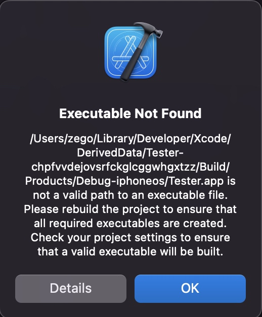
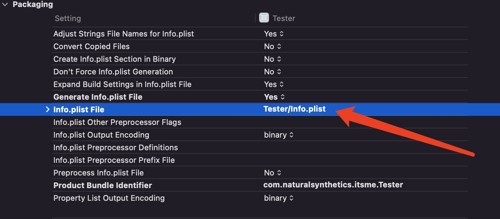
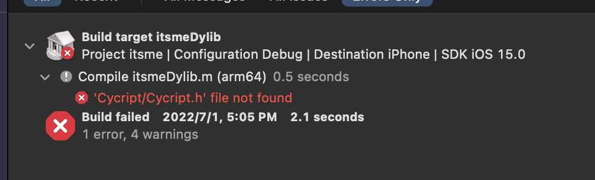
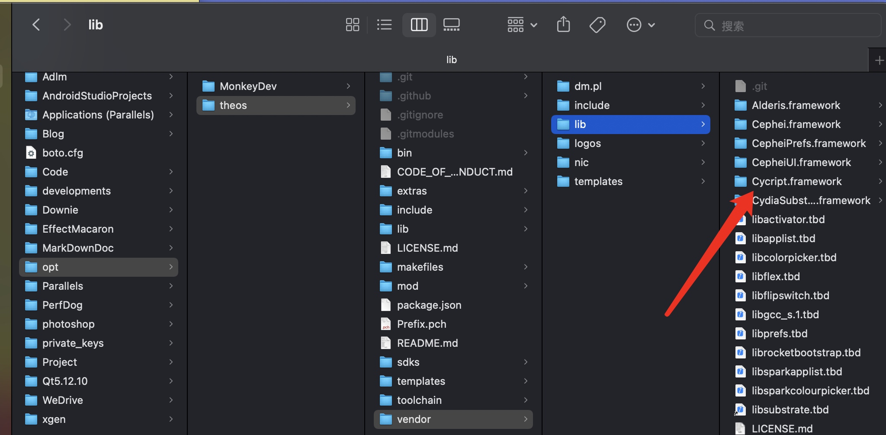
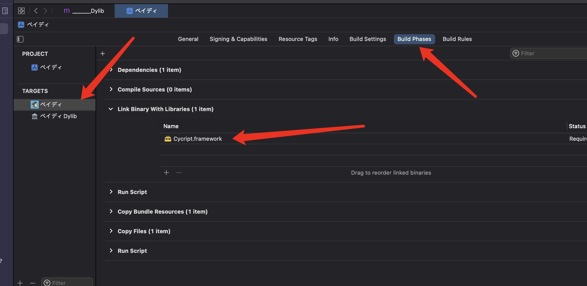

# MonkeyDev

A modified version of iOSOpenDev

* easy to install
* support the latest version of theos
* support CaptainHook Tweak、Logos Tweak、Command-line Tool
* support insert dylib、class-dump、restore-symbol、reveal、cycript，patch and debug iOS Apps, without jailbreak.

Plese Read Wiki: [Wiki](https://github.com/AloneMonkey/MonkeyDev/wiki)

原有iOSOpenDev的升级，非越狱插件开发集成神器！

* 可以使用Xcode开发CaptainHook Tweak、Logos Tweak 和 Command-line Tool，在越狱机器开发插件，这是原来iOSOpenDev功能的迁移和改进。
* 只需拖入一个砸壳应用，自动集成class-dump、restore-symbol、Reveal、Cycript和注入的动态库并重签名安装到非越狱机器。
* 支持调试自己编写的动态库和第三方App
* 支持通过CocoaPods第三方应用集成SDK以及非越狱插件，简单来说就是通过CocoaPods搭建了一个非越狱插件商店。

使用请阅读Wiki文档: [Wiki](https://github.com/AloneMonkey/MonkeyDev/wiki)

非越狱插件CocoaPods私有仓库地址:[MonkeyDevSpecs](https://github.com/AloneMonkey/MonkeyDevSpecs)

 
<h2>常见问题</h2>
<ul>
<li>
1、
问题：编译报错，找不到libstdc++库（file not found: /usr/lib/libstdc++.dylib）
解决方式：https://github.com/devdawei/libstdc- 然后放到xcode里或者执行install-xcode_11+.sh
</li>
<li>
2、
问题：运行crash，在fishhook.c里面
解决办法：下载最新的fishhook，替换工程中的文件https://github.com/facebook/fishhook
</li>
<li>
3、
问题：打不出可执行程序，clean重编，手机电脑重启，后又正常(Executable Not Found....Check your project settings to ensure that a valid executable will be built.) 
解决办法：在项目文件的packaging->Info.plist File添加info.plist路径（“你的app名字/Info.plist”） 
</li>
<li>
4、
问题：‘Cycript/Cycript.h’ file not found

解决办法：找到Cycript.framework，一般在”/Users/zego/opt/theos/vendor/lib”里面, 把这个东西复制到工程里面或者”/Users/zego/opt/MonkeyDev/Frameworks/“下面。把Cycript.framework拖进工程，链接到app target上面，注意链接顺序要在lib之前。

</li>
</ul>

**免责声明: 软件仅供技术交流，禁止用于商业及非法用途，如产生法律纠纷与本人无关。**

 

<h2>《iOS应用逆向与安全》出版啦！！！</h2>

# 购书链接

#### 京东: [https://item.jd.com/12361729.html](https://item.jd.com/12361729.html)

#### 天猫: [https://detail.tmall.com/item.htm?id=570691214072](https://detail.tmall.com/item.htm?id=570691214072)

#### 当当: [http://product.dangdang.com/25283164.html](http://product.dangdang.com/25283164.html)

#### 亚马逊: [https://www.amazon.cn/dp/B07D5952BR/](https://www.amazon.cn/dp/B07D5952BR/)

<h3>请大家多多支持正版哦~</h3>
